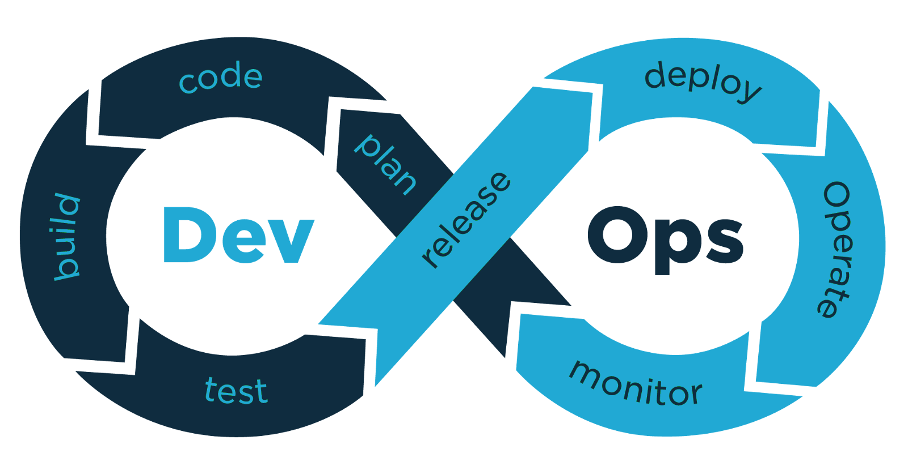

#  Devops
## This is a repository to document my journey in DevOps. I will be doing weekly tasks related to the concepts and tools related to DevOps.

## This repository will contain notes and important information about DevOps.

### Make sure to check it out and explore, you may find some interesting information in this repo.

# Week 1
- What is DevOps?
- What is DevOps culture?
- What are software development lifecycle models?
- What is difference between Waterfall and Agile model?
- Brief history of DevOps.

# Week 2
- Extreme Programming Framework.
- Pair Programming and its Benefits.
- Git Repository Guidelines in Agile Development.
- Benefits of working in Batches in Agile.
- What Exactly is MVP? (Minimum Viable Product).
- Get a Good Basic Understanding of Test-Driven Development (TDD) and Behavior-Driven Development (BDD); and difference between them.
- Why is TDD Important for DevOps?
- What are Cloud Native Microservices?
- Designing for Failure in DevOps.
- What is Taylorism?

