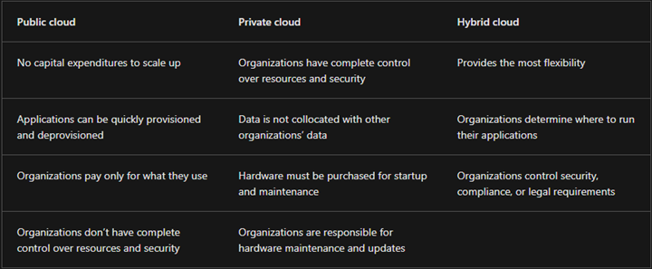

### What is cloud computing? 
**Cloud computing** is the on-demand delivery of IT resources over the Internet with pay-as-you-go pricing. Instead of buying, owning, and maintaining physical data centers and servers, you can access technology services, such as computing power, storage, and databases, on an as-needed basis from a cloud provider like Amazon Web Services (AWS).

### Types of Cloud : 

### Types of Cloud Services

### Shared Responsibility Model

